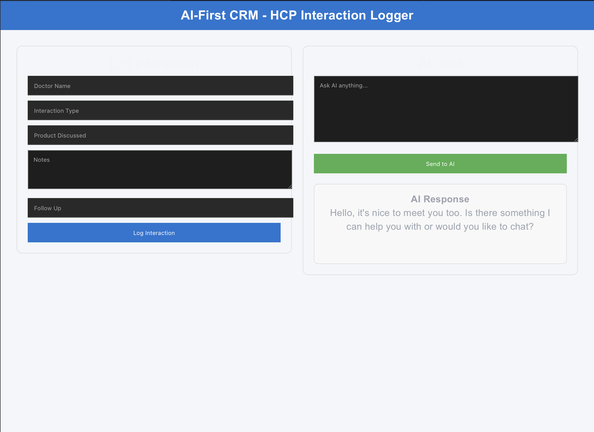
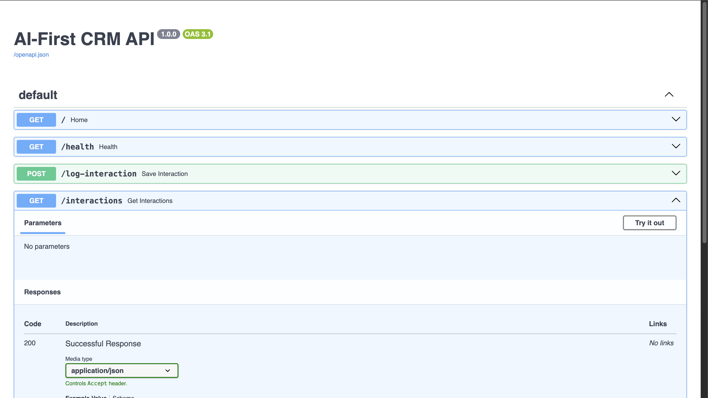

# AI-First CRM HCP Module

An AI-powered Customer Relationship Management (CRM) system designed for Healthcare Professionals (HCPs). This project allows medical representatives to log doctor interactions using either a structured form or an AI-powered conversational interface.

Built as part of the AI-First CRM HCP Module technical assignment.

---

## Features

- Log HCP interactions using a structured form
- AI-powered conversational chat interface
- AI-generated interaction summaries
- PostgreSQL database integration
- Redux state management
- FastAPI backend
- React frontend
- LangGraph AI agent
- Groq LLM integration
- Five CRM AI tools

---

## LangGraph AI Tools

The AI agent provides the following tools:

1. **Log Interaction**
   - Logs a new HCP interaction and generates an AI summary.

2. **Edit Interaction**
   - Allows modification of an existing interaction.

3. **Search HCP**
   - Searches for Healthcare Professionals.

4. **Interaction History**
   - Retrieves previous HCP interactions.

5. **Create Follow-up**
   - Creates follow-up reminders after meetings.

---

## Tech Stack

### Frontend

- React
- Redux Toolkit
- Axios
- Google Inter Font

### Backend

- FastAPI
- LangGraph
- Groq LLM
- SQLAlchemy
- PostgreSQL
- Pydantic

---

## Project Structure

```
AI-First-CRM-HCP
│
├── backend
│   ├── main.py
│   ├── agent.py
│   ├── database.py
│   ├── models.py
│   ├── schemas.py
│   ├── requirements.txt
│   └── .env.example
│
├── frontend
│   ├── src
│   ├── package.json
│   └── ...
│
├── README.md
└── .gitignore
```

---

## Installation

### Clone Repository

```bash
git clone https://github.com/NINAD-sketch/AI-First-CRM-HCP.git
```

```
cd AI-First-CRM-HCP
```

---

## Backend Setup

```bash
cd backend

python -m venv venv

source venv/bin/activate
```

Install dependencies:

```bash
pip install -r requirements.txt
```

Create a `.env` file:

```env
GROQ_API_KEY=YOUR_GROQ_API_KEY
DATABASE_URL=postgresql://YOUR_USERNAME@localhost:5432/ai_first_crm
```

Run the backend:

```bash
uvicorn main:app --reload
```

---

## Frontend Setup

```bash
cd frontend

npm install

npm run dev
```

---

## API Documentation

FastAPI automatically generates Swagger documentation.

```
http://127.0.0.1:8000/docs
```

---

## Database

Database used:

- PostgreSQL 17

ORM:

- SQLAlchemy

---

## AI Model

Groq LLM

Model used:

- llama-3.3-70b-versatile

(The original assignment suggested gemma2-9b-it; the implementation uses llama-3.3-70b-versatile because the former has been deprecated.)

---

# Screenshots

## Frontend



Shows the React-based AI-First CRM interface, including:
- HCP Interaction Form
- AI Chat Interface
- AI Response Panel

---

## Backend



Shows the FastAPI backend, including:
- Swagger API Documentation
- AI Chat Endpoint
- Log Interaction Endpoint
- PostgreSQL Integration

---

## Future Improvements

- Authentication
- User Management
- Dashboard Analytics
- Role-Based Access Control
- AI Recommendation Engine
- Calendar Integration

---

## Author

**Ninad Kuralkar**

GitHub:
https://github.com/NINAD-sketch
